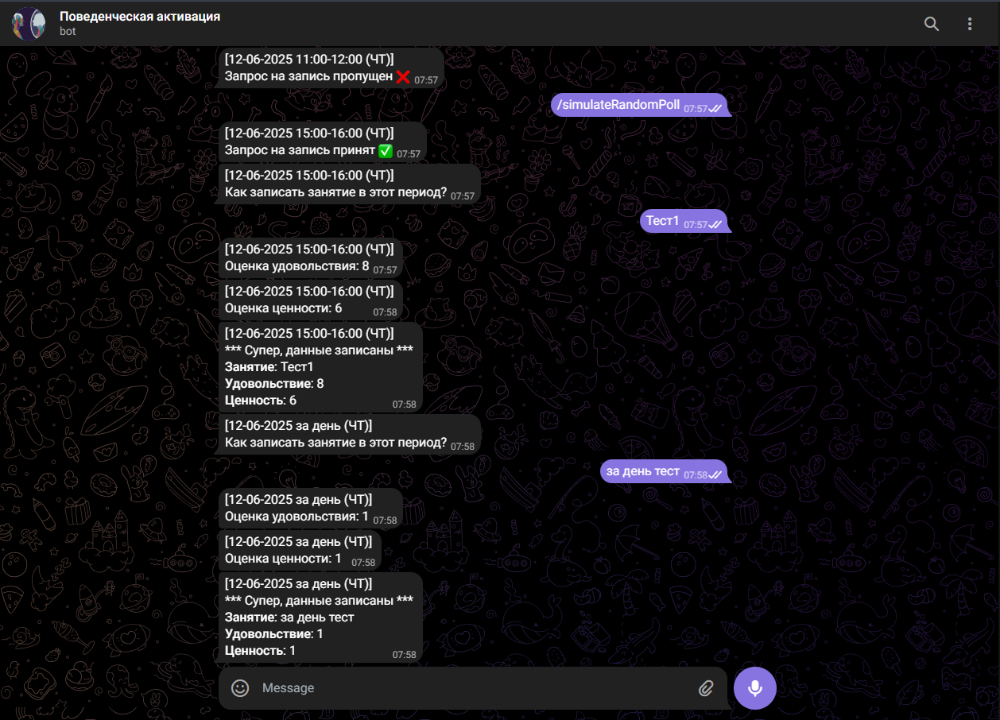

# Self-Reflection Bot
### About
Pure Java implementation bot integrating Telegram API and Google Sheets API to record user's self-reflections during the day. Recorded data is then saved to the target spreadsheet.  
[www.core.telegram.org/bots/api](https://core.telegram.org/bots/api)  
[www.developers.google.com/workspace/sheets/api/reference/rest](https://developers.google.com/workspace/sheets/api/reference/rest)

The flow is quite simple:
- **Every hour** application sends a request to the user (using Telegram Bot) to record a "self-reflection"
- User can choose to react on this request in their own time - the request will stay there for 7 more days; Telegram Bot will show an interactive keyboard to handle this request
- When user is ready, they can click "Yes" button to start a questionnaire, or they can choose to skip this entry and edit it in the Google Sheets manually later
- If user clicks "Yes", the bot starts a questionnaire flow - 3 questions are asked in an interactive manner, where user records their activity during time period, rates their pleasure and value experienced
- Rating's done using an interactive keyboard with rates from 1 to 10
- At the end, the bot sends a confirmation message and sends data to Google Sheets in the background, not disrupting main flow

Just like that, simple but efficient automation.

### Highlights
Although the application is quite simple, there are some features that might be interested here:
- **Telegram Bot API**. The application interface uses telegram bot(s)
- **Google Sheets API**. The main purpose of the application is to simplify logging data to Google Sheets
- **Job scheduling**. Application have 3 scheduled tasks serving different service purpose and running at different intervals - hourly and/or nightly. Within the tasks, additional time management is conducted - for example, requests are  not generated in the night - from 00:00 to 09:00
- **Debug mode**. With a little bit of Java Reflect, application can be run in a DEBUG mode that allows to call the Bot's methods to simulate requests outside of hourly schedule
- **Security**. Sensitive data is loaded from environment variables which give potential to employ external Key Vaults or encrypted secrets in the future
- **Recovery**. Application saves user requests in a file (the next stop would be a database table) each hour and on shutdowns. When application is starting up, it recovers data from the file 
- **Extendability**. Application is designed with an idea of extension and scalability. For example, the Bot implements an idea of a Flow - state machine to control user interactions. Currently, only one flow is supported - polling activity with 3 questions, but it can be extended to Registration flow or Change configuration flow, flow name and stage for each user can be stored in the database, and so on.

### Extension
The purpose of this application is initially quite localized and intended for a small group of people, so a lot of things were meant to be kept simple: for example, the application is currently targeting one user per instance - which keeps package quite isolated and easy to deploy, but it is not scalable if there's need to expand to thousands of users. 
  
How can this application be improved and/or extended?
- Add robust logging using Log4j 2 or logback via SLF4J
- Add JUnit tests
- Add localization (English, at least) and load messages from configuration files, not specify directly in the code
- Add Registration flow to let each user configure their preferences and Google spreadsheet
- Add relational database to store each user's configuration and requests
- Add Docker setup to simplify deployment and update experience
- Finally, migrate to Spring Boot to support high-availability and scalable setup

### Gallery
Prompt to record self-reflection (date / time period / weekday)

Rating keyboard 1-10

Results

Google Sheets structure

